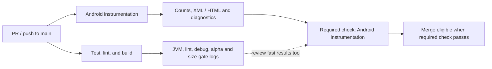

<div align="center">
  
  <h1>Thwiply 🕸️</h1>
  <p><strong>Actionable task extraction out of everyday noise — 100% on-device.</strong></p>
  <p>
    
    
    
    
  </p>
</div>

---

**Thwiply** is an early Android alpha exploring private, on-device notification intelligence. The current build provides a local LLM Lab and a durable manual task interface; it does not yet read or modify Android notifications or screenshots.

---

## 🛡️ Core Principle: Privacy First
LLM inference runs on the Android device. Internet access is used solely to download a pinned model from Hugging Face, and the downloaded file is verified before activation. The alpha has no account, backend, analytics, notification listener, or screenshot observer. Its local Room schema stores approved display fields, decisions, corrections, rules, and minimal source provenance; it has no column for a raw notification body, text, payload, extras, or prompt.

---

## ✨ Features

- **Verified Model Installation:** Resumable download, exact-size validation, SHA-256 verification, and atomic activation.
- **On-Device LLM Lab:** Runs Qwen 2.5 1.5B through LiteRT-LM for local prompt experiments, structured extraction testing, and live performance metrics.
- **Durable Today Tasks:** Manual tasks, completion-state updates, and deletions survive app and database recreation through the repository layer.
- **Privacy-Minimized Data Foundation:** Versioned Room schemas, explicit migrations, 30-day retention for future notification-derived records, a confirmed delete-all control, and explicit database exclusions from cloud backup and device transfer.
- **Real Empty and Failure States:** Today reflects repository-backed `Flow` state instead of hardcoded sample tasks and distinguishes an empty database from a storage failure.
- **Settings & Theme Manager:** Live support for **System Default**, **Dark Mode** (Deep Electric Sapphire & Obsidian Slate), and **Light Mode** (Crisp Porcelain & Electric Cyan).
- **Official Adaptive Branding:** Custom spider-web spinneret icon design with Android 13+ monochrome dynamic theming support.

---

## 🛠️ Tech Stack
- **Language:** Kotlin (Modern Idiomatic)
- **UI Framework:** Jetpack Compose with Material 3
- **Package / Namespace:** `thwiply.elopenmike.com`
- **LLM Runtime:** [LiteRT-LM](https://ai.google.dev/edge/litert) (Google AI Edge on-device acceleration)
- **Model:** Qwen 2.5 1.5B Instruct (pinned LiteRT-LM build)
- **Dependency Injection:** Hilt
- **Local Data:** Room with exported schemas and tested manual migrations
- **Async & Reactive Architecture:** Kotlin Coroutines + Flow / StateFlow
- **Networking:** OkHttp (resumable downloads with byte progress streaming)

---

## 🚀 Getting Started

### Prerequisites
- Android device or emulator with **Min SDK 31 (Android 12+)**.
- About 1.6 GB of free storage for the pinned model, plus installation headroom.
- Pixel 6 or newer (or equivalent ARM64 / x86_64 device) recommended for hardware-accelerated LLM execution.

### Install an alpha release

Each GitHub alpha release provides separate installable APKs:

- `arm64-v8a` for physical Android devices and ARM64 emulators;
- `x86_64-emulator` for x86_64 emulators; and
- `SHA256SUMS` for download verification.

Download only the APK matching the device architecture, then verify it from the
same directory:

```bash
# Replace arm64-v8a with x86_64-emulator when verifying the emulator APK.
# Linux
grep 'arm64-v8a\.apk$' SHA256SUMS | sha256sum -c -

# macOS
grep 'arm64-v8a\.apk$' SHA256SUMS | shasum -a 256 -c -
```

Releases after `v1.0.0-alpha.3` use a persistent alpha signing identity and a
monotonically increasing Android version code. If `v1.0.0-alpha.3` or an earlier
debug-signed build is installed, uninstall it once before installing the first
persistently signed alpha. That uninstall removes local app data and downloaded
models. Later persistently signed alphas can be installed as updates.

The arm64 alpha is minified, contains only arm64 native libraries, and is
enforced below 32 MiB. The pinned model is not bundled in the APK; it is
downloaded and verified after installation.

### Build from source

1. Clone the repository:
   ```bash
   git clone https://github.com/mcasillas17/Thwiply.git
   ```
2. Open the project in **Android Studio Quail 1 (2026.1.1)** or a newer release
   supporting AGP 9.2, per the
   [official compatibility table](https://developer.android.com/build/releases/about-agp#android_gradle_plugin_and_android_studio_compatibility).
3. Build and install the debug APK:
   ```bash
   ./gradlew assembleDebug
   adb install -r app/build/outputs/apk/debug/app-debug.apk
   ```

Maintainers can find signing, artifact, versioning, and tagged-release
instructions in [`docs/RELEASING.md`](docs/RELEASING.md).

### First Launch
On first launch, Thwiply downloads the pinned Qwen 2.5 1.5B model. Interrupted downloads can resume, and the app checks the exact size and SHA-256 digest before activating the model. Once complete, use the **Lab** tab to test local inference.

### Android instrumentation

The full `:app` instrumentation suite runs on the Gradle Managed Device
`pixel2api36` (Pixel 2, API 36, Google APIs). It includes Room reopen, migration,
and backup checks and automatically discovers future instrumentation tests.
These tests use synthetic data: **no model download, inference, signing key, or
Google account is needed**.

Tested toolchain: JDK 21.0.12.1, Gradle 9.4.1, AGP 9.2.1, Kotlin
2.4.20-Beta1, and Android SDK platform 36. CI uses Ubuntu 24.04 x86_64 with
KVM, emulator 37.1.11, and Google APIs 36 x86_64 image revision 7. The same
test command also ran on Apple Silicon with Hypervisor.Framework, emulator
36.3.10, and the Google APIs 36 arm64-v8a image revision 7. SDK revisions are
the observed versions, not frozen downloads; CI records installed versions.
Python 3.9+ is needed for the standard-library result checker.

Set Java and SDK paths before running Gradle. For a Mac with Homebrew JDK 21
and an Android Studio SDK, the tested setup is:

```bash
export JAVA_HOME="$(brew --prefix openjdk@21)/libexec/openjdk.jdk/Contents/Home"
export ANDROID_HOME="$HOME/Library/Android/sdk"
export PATH="$JAVA_HOME/bin:$ANDROID_HOME/platform-tools:$PATH"
java -version
./gradlew --version
```

On Linux, set `JAVA_HOME` to an installed JDK 21 and `ANDROID_HOME` to your
SDK instead. Install Android SDK Command-line Tools through Android Studio's
SDK Manager if `cmdline-tools/latest/bin/sdkmanager` is missing.

On Ubuntu 24.04, install the emulator's host library before preflight:

```bash
sudo apt-get update
sudo apt-get install --yes --no-install-recommends libpulse0
```

Provision the host-native image; select **one** ABI below (do not use x86_64 on
Apple Silicon):

```bash
SDK_ABI=arm64-v8a  # Apple Silicon; use SDK_ABI=x86_64 on x86_64 Linux/Intel Mac
"$ANDROID_HOME/cmdline-tools/latest/bin/sdkmanager" --licenses
"$ANDROID_HOME/cmdline-tools/latest/bin/sdkmanager" --install \
  "emulator" "platform-tools" "platforms;android-36" "build-tools;36.0.0" \
  "system-images;android-36;google_apis;$SDK_ABI"
"$ANDROID_HOME/emulator/emulator" -accel-check
```

Run all tests afresh, using the same Gradle command as CI. No manually created
AVD or already-running device is needed:

```bash
./gradlew clean :app:pixel2api36DebugAndroidTest \
  -Pandroid.testoptions.manageddevices.emulator.gpu=swiftshader_indirect \
  -Pandroid.experimental.testOptions.managedDevices.setupTimeoutMinutes=5 \
  -Pandroid.experimental.testOptions.managedDevices.maxConcurrentDevices=1 \
  --rerun-tasks --no-build-cache --stacktrace --info --no-daemon
python3 scripts/check-instrumentation-results.py \
  app/build/outputs/androidTest-results/managedDevice/debug/pixel2api36
bash scripts/test-release-workflows.sh
bash scripts/test-check-apk-size.sh
```

`clean` removes old project reports; `--rerun-tasks --no-build-cache` prevents
cached test outcomes. Gradle manages device creation, clean baseline snapshots,
headless startup, and shutdown; animations are disabled and only one managed
device runs at a time. Do not add class selectors to CI: the full suite must run.
The checker fails on missing reports/classes, inconsistent counts, duplicates,
errors, assertion failures, or skipped tests. The current baseline executes 11
tests: `ThwiplyDatabaseTest` 8, `ThwiplyMigrationTest` 1,
`BackupConfigurationTest` 1, and `ExampleInstrumentedTest` 1.

Local HTML: `app/build/reports/androidTests/managedDevice/debug/allDevices/index.html`.
XML and per-test logcat:
`app/build/outputs/androidTest-results/managedDevice/debug/pixel2api36/`.
CI publishes counts in its job summary and retains an
`instrumentation-<run_id>-<attempt>` artifact for 14 days, including HTML/XML,
test-result files, test logs, and SDK/KVM/Gradle diagnostics, even on failure.
Logs contain synthetic test data only; do not add credentials, environment
dumps, model files, or personal device data to the artifact allowlist.

### CI and merge gate

Pull requests to `main` and pushes to `main` run two independent jobs:



The fast job preserves build-tool security verification, JVM tests, lint, the
debug build, the minified arm64 alpha build, and the 32 MiB APK-size gate.
The device job provisions SDK/host dependencies within 10 minutes, checks KVM
within 2 minutes, and bounds Gradle setup plus execution to 30 minutes. Its
50-minute job limit leaves time for tool setup and artifact upload. The
5-minute GMD setup setting is per attempt; retries remain inside the 30-minute
step limit. Gradle handles normal emulator shutdown; GitHub disposes of the
isolated runner and remaining processes after a timeout or cancellation.

The device job deliberately disables the Gradle action's cache as well as the
build cache, so every CI run proves cold SDK/device provisioning without
restoring managed snapshots. This costs extra dependency downloads and builds
(the recorded restoration job took about 8 minutes); the fast job retains its
existing cache. This is a cold-environment reliability gate, not a throughput
benchmark or minified inference smoke test.

Main's active [instrumentation ruleset](https://github.com/mcasillas17/Thwiply/rules/22323517)
requires the exact **Android instrumentation** check from GitHub Actions,
with an up-to-date branch and no bypass actors. Existing deletion/force-push
protections are unchanged. Only this device check was added as required;
maintainers should still inspect both CI jobs before merging. Fork PRs use
`pull_request`, read-only repository permissions, and no signing secrets.
Completion evidence and roadmap status live in [`docs/ROADMAP.md`](docs/ROADMAP.md).

Common failures:

| Symptom | Action |
|---|---|
| Java is missing or the wrong version launches Gradle | Set `JAVA_HOME` and `PATH` to JDK 21; confirm both `java -version` and `./gradlew --version`. |
| Emulator binary missing, or `libpulse.so.0` cannot load on Ubuntu | Install the SDK `emulator` package and Ubuntu `libpulse0` before preflight. |
| SDK license/image download failure | Run `sdkmanager --licenses`; verify the API 36 Google APIs image for the host ABI and available disk/network access. Do not skip the job. |
| KVM unavailable or permission denied | Enable CPU virtualization and grant the runner user read/write access to `/dev/kvm`. Nested virtualization must be available when Linux is itself a VM. On macOS, inspect `emulator -accel-check` for Hypervisor.Framework. |
| Boot, snapshot, or rendering timeout | Read the retained SDK and Gradle logs first; check acceleration and host ABI. Use the documented SwiftShader command; do not hide the failure or raise limits without evidence. |
| Missing, skipped, or zero-count tests | Inspect XML and test discovery; remove unintended filters and rerun the full clean command. APK assembly is not test execution. |
| Cancelled CI run | New pushes supersede older runs. Wait for the latest run; cancellation is neither a passing check nor assertion-failure evidence. |

---

## 🗺️ Roadmap

The canonical product roadmap, current status, dependency-ordered execution
queue, launch gates, privacy requirements, and non-goals live in
[`docs/ROADMAP.md`](docs/ROADMAP.md).

**Current:** The secure alpha and durable local data foundation are complete.

**Next:** Foundation hardening precedes Phase 2, which adds explicit
notification-access consent, an empty-by-default per-app allowlist, and bounded
notification ingestion. Structured local triage and the trustworthy **Now** /
**Later** / **Needs review** experience follow in Phases 3 and 4.

---

## 📄 License
This project is licensed under the **MIT License**. See [LICENSE](LICENSE) for details.

---

*The name Thwiply is inspired by the sound of Spider-Man's web-shooters — catching the important things before they fall through the cracks.*
