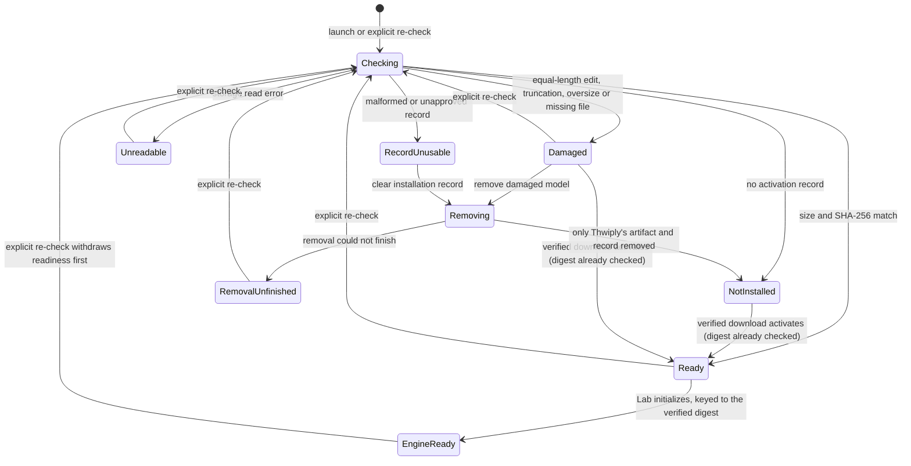
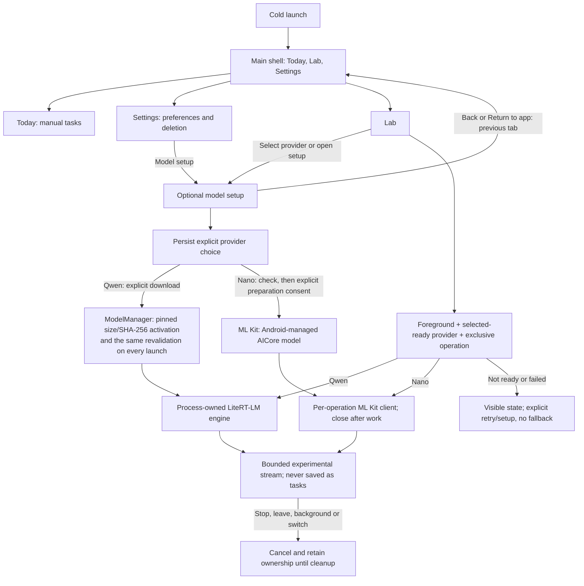
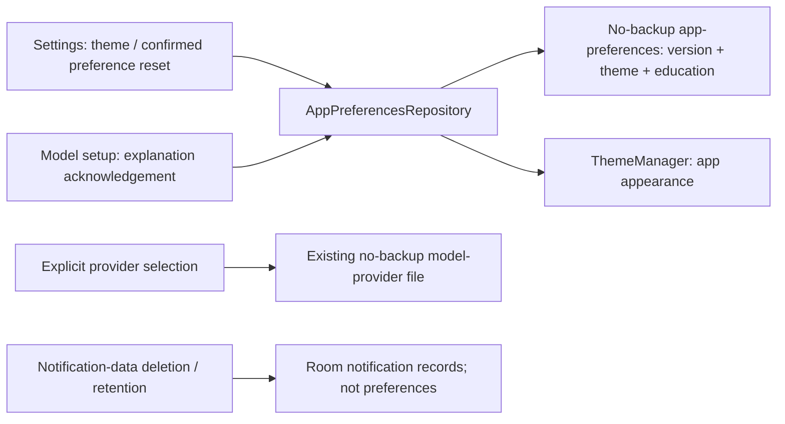
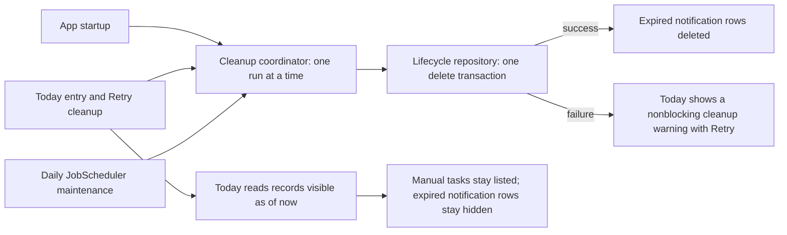
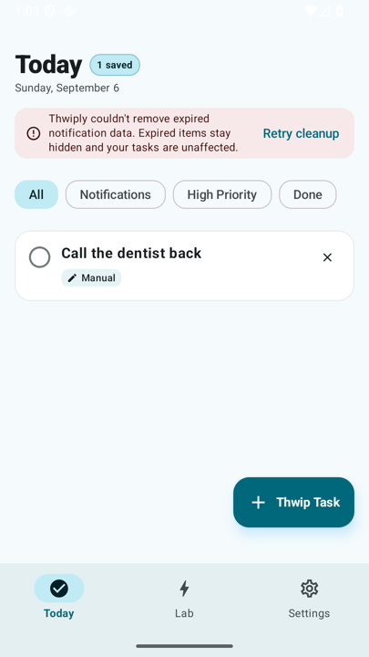
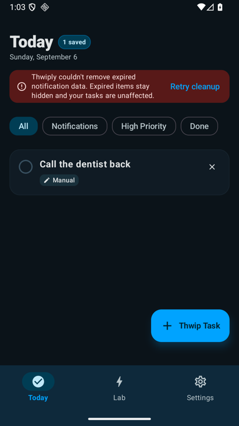
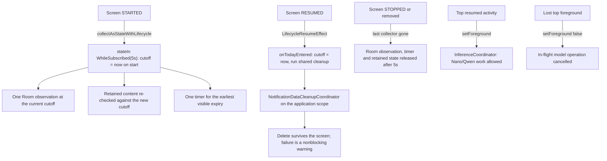
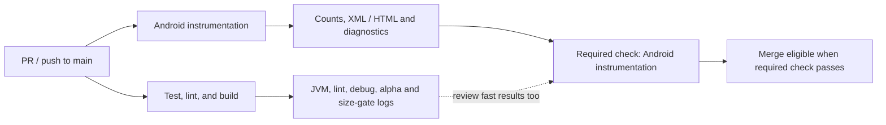

<div align="center">
  
  <h1>Thwiply 🕸️</h1>
  <p><strong>Manual tasks and experimental AI, with inference on-device.</strong></p>
  <p>
    
    
    
    
  </p>
</div>

---

**Thwiply** is an early Android alpha exploring private, on-device notification intelligence. The current build provides a local LLM Lab and a durable manual task interface; it does not yet read or modify Android notifications or screenshots.

---

## 🛡️ Core Principle: Privacy First
LLM prompts and responses are processed on the Android device, not by a cloud
inference service. Qwen downloads come from Hugging Face and are verified before
activation. Android AICore manages Gemini Nano downloads and updates separately.
The included ML Kit SDK contacts Google for updates/configuration and sends usage
and performance metrics, including identifiers and input/output sizes; it does
not send the feature's prompts or responses to Google. Its initialization provider
can run before a user selects Nano. On-device inference does **not** mean no
network activity or no SDK telemetry.

The alpha has no app account, app-owned backend or product analytics, notification
listener, or screenshot observer. Lab experiments are not automatically saved as
tasks. The local Room schema has no column for a raw notification body, text,
payload, extras, or prompt. See [ML Kit privacy terms](https://developers.google.com/ml-kit/terms#privacy)
and [Android data disclosure](https://developers.google.com/ml-kit/android-data-disclosure).
Nano use is for adults (18+) under the
[GenAI terms](https://developers.google.com/ml-kit/genai-terms); the
[release guidance](docs/RELEASING.md#gemini-nano-policy-and-device-gates) describes
the additional audience and data-disclosure gates.

---

## ✨ Features

- **Verified Model Installation:** Resumable download, exact-size validation, SHA-256 verification, and atomic activation — revalidated in full on every launch, so damaged weights are reported instead of loaded.
- **Two Explicit On-Device Providers:** Qwen 2.5 1.5B through LiteRT-LM, or optional Gemini Nano through ML Kit/AICore on supported devices. Selection persists; failures never silently switch providers or download Qwen.
- **Foreground LLM Lab:** Bounded streaming experiments, Stop, safe failure states, and character-based metrics. JSON output remains experimental: it is neither validated product triage nor automatically persisted as tasks.
- **Durable Today Tasks:** Manual tasks, completion-state updates, and deletions survive app and database recreation through the repository layer.
- **Optional Model Setup:** Today and Settings are available without model weights. Enter or resume setup from inside the app; Lab enables inference only when its model and local engine are ready.
- **Privacy-Minimized Data Foundation:** Versioned Room schemas, explicit migrations, 30-day retention for future notification-derived records, a confirmed delete-all control, and explicit database exclusions from cloud backup and device transfer.
- **Centralized Retention Cleanup:** One coordinator purges expired notification-derived records at app startup, on Today entry, and once a day in the background; expired records stop being shown even when a delete fails, and manual tasks stay usable.
- **Real Empty and Failure States:** Today reflects repository-backed `Flow` state instead of hardcoded sample tasks and distinguishes an empty database from a storage failure.
- **Persistent App Preferences:** **System Default**, **Dark Mode** (Deep Electric Sapphire & Obsidian Slate), and **Light Mode** (Crisp Porcelain & Electric Cyan) survive app restarts. Optional model-setup education is versioned and remembered separately from provider selection or consent.
- **Official Adaptive Branding:** Custom spider-web spinneret icon design with Android 13+ monochrome dynamic theming support.

---

## 🛠️ Tech Stack
- **Language:** Kotlin (Modern Idiomatic)
- **UI Framework:** Jetpack Compose with Material 3
- **Package / Namespace:** `thwiply.elopenmike.com`
- **LLM Runtimes:** [LiteRT-LM](https://ai.google.dev/edge/litert) and [ML Kit Prompt API](https://developers.google.com/ml-kit/genai/prompt/android/get-started) (`genai-prompt:1.0.0-beta2`)
- **Models:** Qwen 2.5 1.5B Instruct (pinned app-managed artifact), or Gemini Nano (Android-managed shared model, default stable configuration)
- **Dependency Injection:** Hilt
- **Local Data:** Room with exported schemas and tested manual migrations
- **Async & Reactive Architecture:** Kotlin Coroutines + Flow / StateFlow
- **Networking:** OkHttp (resumable downloads with byte progress streaming)

---

## 🚀 Getting Started

### Prerequisites
- Android device or emulator with **Min SDK 31 (Android 12+)**.
- For Qwen: about 1.6 GB of free storage for weights, plus installation/runtime headroom; Pixel 6 or equivalent ARM64 hardware recommended. The x86_64 build supports emulator development.
- For Nano: the SDK must report availability for the device and its AICore configuration. A shared model download may be needed and still consumes storage/RAM; there is no universal footprint or promise of emulator support.
- Nano acceptance requires real inference on a supported physical device. Current deterministic and emulator coverage is **not** that evidence; see the [roadmap](docs/ROADMAP.md#optional-foreground-gemini-nano).

### Install an alpha release

Each GitHub alpha release provides separate installable APKs:

- `arm64-v8a` for physical Android devices and ARM64 emulators;
- `x86_64-emulator` for x86_64 emulators; and
- `SHA256SUMS` for download verification.

Download only the APK matching the device architecture, then verify it from the
same directory:

```bash
# Replace arm64-v8a with x86_64-emulator when verifying the emulator APK.
# Linux
grep 'arm64-v8a\.apk$' SHA256SUMS | sha256sum -c -

# macOS
grep 'arm64-v8a\.apk$' SHA256SUMS | shasum -a 256 -c -
```

Releases after `v1.0.0-alpha.3` use a persistent alpha signing identity and a
monotonically increasing Android version code. If `v1.0.0-alpha.3` or an earlier
debug-signed build is installed, uninstall it once before installing the first
persistently signed alpha. That uninstall removes local app data and downloaded
Qwen weights. Android manages the shared Nano model independently. Later
persistently signed alphas can be installed as updates.

The arm64 alpha is minified, contains only arm64 native libraries, and is
enforced below 32 MiB. Neither model's weights are bundled in the APK. You can
explicitly download and verify Qwen or check/prepare Android-managed Nano through
model setup.

### Build from source

1. Clone the repository:
   ```bash
   git clone https://github.com/mcasillas17/Thwiply.git
   ```
2. Open the project in **Android Studio Quail 1 (2026.1.1)** or a newer release
   supporting AGP 9.2, per the
   [official compatibility table](https://developer.android.com/build/releases/about-agp#android_gradle_plugin_and_android_studio_compatibility).
3. Build and install the debug APK:
   ```bash
   ./gradlew assembleDebug
   adb install -r app/build/outputs/apk/debug/app-debug.apk
   ```

Maintainers can find signing, artifact, versioning, and tagged-release
instructions in [`docs/RELEASING.md`](docs/RELEASING.md).

### First Launch

Thwiply opens **Today** without downloading a model. Create and manage manual
tasks immediately, or open **Settings** for preferences and the confirmed
notification-data deletion control. These features remain available when a
model is missing or unusable.

Choose **Model setup** in Settings or **Select on-device provider** in Lab.
Qwen is the default only when no choice has been saved. Selection is stored
separately from model installation; changing it does not delete manual tasks,
notification-data rules, or existing Qwen weights.

| Provider | Setup and ownership |
|---|---|
| Qwen 2.5 1.5B | **Download or resume model** (or **Retry download**) installs the revision-pinned, 1.49 GiB LiteRT-LM artifact in Thwiply's private no-backup storage. Size and SHA-256 checks precede activation, and the same checks run again on every launch before the artifact is adopted. Existing installations remain available. |
| Gemini Nano | Read and confirm the adult-use/SDK-metrics notice to select it. **Check availability** queries the SDK; **Prepare or download Gemini Nano** then requires separate download consent. Android manages the shared model; this is not another downloadable `.litertlm` preset. Thwiply cannot delete AICore's shared model. |

Nano distinguishes checking, unavailable, downloadable, downloading, ready and
failed states. **Unavailable** can mean unsupported hardware or incomplete AICore
configuration; it is not a permanent compatibility verdict. Update Android/AICore
when appropriate and check again explicitly. A download in progress has no
invented percentage. A failed or unavailable Nano selection stays selected,
including after restart; Qwen is an explicit alternative, never a fallback.

Back and **Return to app** return to the previous tab. Setup completion does not
redirect you away from manual work. Qwen verification runs off the main thread;
every state is visible without preventing Today, Settings or Nano use.

#### Qwen artifact states

Thwiply's own Qwen artifact has one explicit state. It is never inferred from the
presence of a file: after every process start, and on every explicit re-check, the
whole approved artifact is streamed through SHA-256 in a bounded buffer and its
size is confirmed, so an equal-length edit or a truncation is rejected instead of
adopted. Nothing is hashed on the main thread, and manual Today tasks, the
notification-data deletion control and navigation stay usable in every state.

| State | What it means | What you can do |
|---|---|---|
| **Checking** | Size and SHA-256 are being revalidated off the main thread. | Wait, or keep using Today and Settings. |
| **Not installed** | No activation record exists. | **Download or resume model**. |
| **Ready** | The installed bytes match the approved size and digest. | Open Lab to initialize the engine. |
| **Damaged** | The record names an approved model whose bytes are not the approved release, or whose file is gone. | **Check installed model again**, download it again, or **Remove damaged model** / **Clear installation record**. |
| **Removing** | An explicit discard of rejected bytes is running. | Wait; nothing else is removed. |
| **Unreadable** | Storage could not be read. | **Check installed model again**. |
| **Record unusable** | The activation record is malformed, or names a model this build does not approve. | **Clear installation record**, then download again. Re-checking is not offered: re-reading the same record fails the same way. |
| **Removal unfinished** | A discard could not complete, so storage and the record may disagree. | **Check installed model again**, then clear whatever remains. |

Re-checking never starts a network download, and removal only ever deletes
Thwiply's own damaged artifact and its activation record — never manual tasks,
provider choices, preferences, or partially downloaded data you can still resume.
A replacement download that fails verification leaves a working installation
untouched; a working installation that later fails revalidation stops being
reported as ready.

Three kinds of readiness are separate and are shown separately. **Artifact
verification** is about Thwiply's own Qwen file. **Engine readiness** is about the
LiteRT-LM engine actually being loaded, and it is keyed to the verified content,
so replacing the file at the same path cannot reuse an engine loaded from the
previous bytes. **AICore readiness** belongs to Android's shared Gemini Nano model,
which Thwiply neither verifies nor deletes. A damaged Qwen artifact never makes
Nano unavailable, and Nano's availability never makes Qwen ready.



Interrupted downloads retain partial data and resume when supported by the
server. Leaving setup or losing top foreground cancels Thwiply's operation; an
in-flight network read or native operation can take time to unwind before another
can start. No app model download is scheduled in the background. Android may
continue its own shared Nano download after Thwiply stops observing it.

The **Lab** tab is always reachable and clearly identifies the selected provider.
Opening it initializes installed Qwen weights or checks Nano; only a ready
provider can generate. Stop, leaving Lab, losing top foreground, and switching
providers cancel owned work. Switching clears old output and metrics. Busy,
quota, background denial, safety rejection, empty output, time limits and other
failures are visible without automatic retries. Safety-rejected and empty
responses clear the displayed output.

Nano's **platform** restriction permits inference only in the top foreground
app; a foreground service is insufficient. This alpha keeps all setup/Lab model
work foreground-scoped, including Qwen. Nano is **not a background notification-
triage backend**. No notification ingestion or deferred notification-content
processing is implemented.

Lab limits are 2,000 UTF-16 input units, 6,000 for the complete prompt including
the JSON wrapper, and 8,000 for displayed output. Nano additionally counts the
actual prompt: input must be below 4,000 tokens and input plus configured output
must fit `getTokenLimit()`. The pinned beta2 request builder supports **at most
256 output tokens**, despite newer online references showing larger limits.
Truncation is reported as incomplete, not successful JSON extraction.

Nano status checks use a 30-second deadline, engine initialization/generation two
minutes, and downloads 15 minutes. These are cooperative deadlines, not promises that
blocking native cleanup finishes immediately; controls stay busy until owned
work unwinds. Metrics count Unicode code points, not streamed chunks or model
tokens. Do not treat experimental output as validated triage or high-stakes advice.



### App preferences and setup education

Choose **System**, **Light**, or **Dark** under Settings > Appearance. The choice
is saved locally and restored on process restart. With no saved preferences,
the defaults are System theme and an unseen model-setup explanation. Before the
initial read finishes, the app follows system appearance without claiming that
System is a saved choice; Today and Settings remain available without a model.

In optional model setup, **Got it** remembers acknowledgement of the existing
explanation about optional setup, provider choice, and preserving tasks/weights.
**About model setup** reopens it at any time. This is not onboarding completion:
the saved value identifies the explanation version, not which screen was open.
If that version changes, the explanation appears again. It never selects a
provider, grants notification access, or authorizes preparation or downloads.
Both Nano's adult-use/SDK disclosure confirmation and its separate preparation
confirmation remain required for their respective actions.

**Storage failures are not defaults.** Settings and model setup distinguish an
unreadable file, damaged data, an unsupported format/value, and failed saves or
resets using accessible, resource-backed messages. Failed writes retain the last
saved choices. An unsafe read disables preference edits without blocking manual
features. **Retry reading preferences** recovers existing saved values without
overwriting them. If necessary, Settings offers **Reset app preferences**, with a
confirmation explaining that only theme and education will be reset. A failed
reset still offers read recovery; it never turns unknown data into a successful
default or silently enables edits.

The typed `AppPreferencesRepository` stores only a format version, theme enum,
and model-setup education version in `noBackupFilesDir/app-preferences`. Its
strict format is bounded to 256 bytes. Reads and serialized writes run off the
main thread; writes sync a single reusable candidate and atomically replace the
committed file before publishing state. An interrupted candidate is never read
as saved preferences and is reused by the next write. Cancellation before commit
prevents the write; a commit already in progress finishes disk/state publication
together before cancellation is delivered to the caller.

Preferences contain **no notification content, prompts, model output, or
credentials**. They are excluded from Android backup and device transfer through
the platform's [no-backup directory rules](https://developer.android.com/identity/data/autobackup#Files).
The existing `model-provider` file remains the sole provider-selection store;
there is no provider migration. Resetting preferences does not touch that file,
Qwen weights, manual tasks, notification data, or permissions. Conversely,
notification-data deletion and retention cleanup do not reset app preferences.
Existing database backup exclusions remain in place.



Preference regression coverage uses the existing test stack:

```bash
./gradlew :app:testDebugUnitTest --tests '*AppPreferencesRepositoryTest' \
  --tests '*ThemeManagerTest'
./gradlew :app:pixel2api36DebugAndroidTest \
  -Pandroid.testoptions.manageddevices.emulator.gpu=swiftshader_indirect
```

The device suite includes preference recovery, activity recreation, education
replay, and preserved Nano confirmation flows. See the
[FND-07 evidence](docs/ROADMAP.md#fnd-07-evidence) for separate real process-restart
observations and their limits.

### Notification-data retention and cleanup

Notification-derived records expire **30 days after they are created**. Manual tasks never
expire and this policy never deletes them, rules, or corrections belonging to manual records.
Editing or completing a record does not shorten, extend, or restart its retention. Notification
ingestion does not exist yet, so the policy currently applies to migrated or test rows only.

One coordinator owns the policy; every trigger reuses it and runs one delete transaction:



**Logical expiry and physical deletion are different.** Today reads records against the current
time, so an expired notification-derived record stops being shown the moment it expires — even
if the delete has not run yet or failed. A notification record with a missing expiry has unknown
retention: it is hidden immediately and deleted by cleanup rather than kept forever. Physical
deletion happens on the next successful cleanup.
Android may defer or drop deferrable background work, so nothing here promises deletion at the
exact 30-day timestamp, and none of it is a forensic secure erase: SQLite can retain freed
pages until they are reused. Settings ▸ **Delete notification data and rules** remains the
immediate, explicit deletion path; expiry cleanup never invokes it as a fallback.

<div align="center">
  
  
  <p><em>The nonblocking cleanup warning in light and dark themes. Synthetic manual task;
  the retention delete was forced to fail on a debug build to capture this state.</em></p>
</div>

**Failure behavior.** A cleanup failure never blocks Today: manual tasks stay listed and
usable, expired notification records stay hidden, and a nonblocking warning offers **Retry
cleanup**. A record *read* failure is separate and still renders the explicit storage-error
state rather than an empty list. Cleanup diagnostics are content-free — trigger, outcome,
operation, failure reason, a deleted count, and — for an unexpected failure — the exception's
class name as a bounded error code. `ThwiplyAppScope` carries the same bounded record for an
unexpected failure in background maintenance:

```bash
adb logcat -s ThwiplyCleanup ThwiplyAppScope
```

**Periodic maintenance limitations.** Startup registers one platform `JobScheduler` periodic
job (id `1912`, service `NotificationMaintenanceJobService`) with a one-day interval: at most
one attempt per day, one delete transaction per run, no network, charging, idle, or persistence
requirement, and no retry after a failed run — the next daily window is the retry. Repeated
launches never enqueue a duplicate or restart the interval. The job is not persisted across
reboot; the next app start re-registers it and runs cleanup itself, so foreground triggers
remain the reliable path. Force-stopping the app clears its jobs; the next launch registers a
new one, and Android may run that new period's first window right away. The automated suite
asserts registration, non-duplication, and the shared cleanup policy, not that Android chose to
execute a deferred window; one instrumentation test does schedule a real immediate job and
prove the service reports itself finished. On a debuggable build you can force a run of the
daily job and read its diagnostics:

```bash
adb shell cmd jobscheduler run -f thwiply.elopenmike.com 1912
```

Reproduce the automated coverage locally:

```bash
./gradlew :app:testDebugUnitTest --tests 'thwiply.elopenmike.com.domain.cleanup.*' \
  --tests 'thwiply.elopenmike.com.ui.today.*' \
  --tests 'thwiply.elopenmike.com.data.repository.*'
./gradlew :app:pixel2api36DebugAndroidTest \
  -Pandroid.testoptions.manageddevices.emulator.gpu=swiftshader_indirect
```

### Screen and application state ownership

Every observable flow in Thwiply belongs to exactly one owner, and that owner decides when
observation stops.

| Owner | What it holds | When it stops |
|---|---|---|
| Screen | Today's Room observation of visible records, its single next-expiry timer, and the state it last rendered | shortly after the last lifecycle-aware collector stops (a 5 s grace, so a rotation or tab return reuses the same observation instead of opening a second one) |
| ViewModel | Lab's provider-change reset, model setup's Qwen load-state watcher, filters, pending errors and input failures | when the owning `ViewModel` is cleared |
| Application | retention cleanup, the daily maintenance job, provider selection, model load state, engine and Nano ownership | never because a screen left composition |

Every screen reads state with `collectAsStateWithLifecycle()`, so a stopped screen collects
nothing and a started one re-reads. Today goes further: its records are a `stateIn` flow shared by every collector, so
leaving the tab, backgrounding the app, or briefly composing two copies of the screen during a
transition can never open a second database observer or leave a timer running. Starting to
collect is itself the visibility boundary — Compose collects at `STARTED`, earlier than Today's
`RESUMED` entry callback — so a restarted subscription always reads at the current time.

What Today last rendered lives exactly as long as the observation behind it. Inside the grace,
a recreation or tab return keeps the content on screen. Past it, Today resets and reloads rather
than replaying a snapshot nothing was observing — a record may have reached its retention, or
Settings may have deleted the notification data, while the screen was away. While an observation
is live, an expiry is re-checked per record against that row's own retention: the row past its
retention is hidden immediately, one still within it keeps rendering, and manual tasks have no
retention at all.

The grace period keeps the shared subscription alive across a brief collector gap; it does not
suppress a read. Today entry and every resume deliberately re-read at the current time, so
re-entering Today issues one read when collection starts and another when the screen resumes.
That is one extra local query per entry, traded for never rendering a record that expired while
the screen was away.

A cleanup run that Today started is application-owned: leaving the screen cannot cancel the
delete, turn a failure into a success, or stop the daily job.

**Lifecycle-aware collection is not Nano's foreground restriction.** Collection follows the
`STARTED` lifecycle state and only decides when the UI observes data. Gemini Nano's platform
rule is stricter and unrelated: inference is permitted only while Thwiply is the *top resumed*
app, which `MainActivity.onTopResumedActivityChanged`/`onPause` report to `InferenceCoordinator`.
A visible-but-not-top activity, and a foreground service, are both insufficient. That gate
cancels in-flight model work; `collectAsStateWithLifecycle` never replaces it.



Reproduce the automated coverage locally:

```bash
./gradlew :app:testDebugUnitTest --tests 'thwiply.elopenmike.com.ui.today.*'
./gradlew :app:pixel2api36DebugAndroidTest \
  -Pandroid.testoptions.manageddevices.emulator.gpu=swiftshader_indirect \
  -Pandroid.testInstrumentationRunnerArguments.class=thwiply.elopenmike.com.ui.today.TodayLifecycleObservationTest,thwiply.elopenmike.com.TodayLifecycleAppTest
```

### Android instrumentation

The full `:app` instrumentation suite runs on the Gradle Managed Device
`pixel2api36` (Pixel 2, API 36, Google APIs). It includes Room reopen, migration,
and backup checks and automatically discovers future instrumentation tests.
These tests use synthetic data: **no model download, inference, signing key, or
Google account is needed**.

Tested toolchain: JDK 21.0.12.1, Gradle 9.4.1, AGP 9.2.1, Kotlin
2.4.20-Beta1, and Android SDK platform 36. CI uses Ubuntu 24.04 x86_64 with
KVM, emulator 37.1.11, and Google APIs 36 x86_64 image revision 7. The same
test command also ran on Apple Silicon with Hypervisor.Framework, emulator
36.3.10, and the Google APIs 36 arm64-v8a image revision 7. SDK revisions are
the observed versions, not frozen downloads; CI records installed versions.
Python 3.9+ is needed for the standard-library result checker.

Set Java and SDK paths before running Gradle. For a Mac with Homebrew JDK 21
and an Android Studio SDK, the tested setup is:

```bash
export JAVA_HOME="$(brew --prefix openjdk@21)/libexec/openjdk.jdk/Contents/Home"
export ANDROID_HOME="$HOME/Library/Android/sdk"
export PATH="$JAVA_HOME/bin:$ANDROID_HOME/platform-tools:$PATH"
java -version
./gradlew --version
```

On Linux, set `JAVA_HOME` to an installed JDK 21 and `ANDROID_HOME` to your
SDK instead. Install Android SDK Command-line Tools through Android Studio's
SDK Manager if `cmdline-tools/latest/bin/sdkmanager` is missing.

On Ubuntu 24.04, install the emulator's host library before preflight:

```bash
sudo apt-get update
sudo apt-get install --yes --no-install-recommends libpulse0
```

Provision the host-native image; select **one** ABI below (do not use x86_64 on
Apple Silicon):

```bash
SDK_ABI=arm64-v8a  # Apple Silicon; use SDK_ABI=x86_64 on x86_64 Linux/Intel Mac
"$ANDROID_HOME/cmdline-tools/latest/bin/sdkmanager" --licenses
"$ANDROID_HOME/cmdline-tools/latest/bin/sdkmanager" --install \
  "emulator" "platform-tools" "platforms;android-36" "build-tools;36.0.0" \
  "system-images;android-36;google_apis;$SDK_ABI"
"$ANDROID_HOME/emulator/emulator" -accel-check
```

Run all tests afresh, using the same Gradle command as CI. No manually created
AVD or already-running device is needed:

```bash
./gradlew clean :app:pixel2api36DebugAndroidTest \
  -Pandroid.testoptions.manageddevices.emulator.gpu=swiftshader_indirect \
  -Pandroid.experimental.testOptions.managedDevices.setupTimeoutMinutes=5 \
  -Pandroid.experimental.testOptions.managedDevices.maxConcurrentDevices=1 \
  -Pthwiply.versionName=local-test-version \
  --rerun-tasks --no-build-cache --stacktrace --info --no-daemon
python3 scripts/check-instrumentation-results.py \
  app/build/outputs/androidTest-results/managedDevice/debug/pixel2api36
bash scripts/test-release-workflows.sh
bash scripts/test-check-apk-size.sh
```

`clean` removes old project reports; `--rerun-tasks --no-build-cache` prevents
cached test outcomes. Gradle manages device creation, clean baseline snapshots,
headless startup, and shutdown; animations are disabled and only one managed
device runs at a time. Do not add class selectors to CI: the full suite must run.
The checker fails on missing reports/classes, inconsistent counts, duplicates,
errors, assertion failures, or skipped tests. The current suite executes 44
tests: `ThwiplyDatabaseTest` 12, `ThwiplyMigrationTest` 1,
`BackupConfigurationTest` 1, `ExampleInstrumentedTest` 1,
`AppNavigationTest` 12, `ModelOptionalLaunchTest` 2,
`NotificationMaintenanceSchedulerTest` 2, `TodayCleanupFailureTest` 1,
`ProviderControlsTest` 6, `ProviderSetupTest` 1, `PreferenceActivityTest` 3,
and `PreferenceStatusTest` 2. The
FND-01 foundation baseline remains 11 tests; FND-02 adds 11 navigation tests and
FND-12 adds 7 retention-cleanup tests. The optional-provider work adds 9 cases,
and FND-07 adds 6 preference/consent cases.
Provider controls use deterministic callbacks; the real-activity test covers
selection persistence and navigation, not successful AICore inference or a real
model download. JVM tests additionally use fake engines/SDK clients, actual
beta2 request builders, and small local artifact fixtures.

Local HTML: `app/build/reports/androidTests/managedDevice/debug/allDevices/index.html`.
XML and per-test logcat:
`app/build/outputs/androidTest-results/managedDevice/debug/pixel2api36/`.
CI publishes counts in its job summary and retains an
`instrumentation-<run_id>-<attempt>` artifact for 14 days, including HTML/XML,
test-result files, test logs, and SDK/KVM/Gradle diagnostics, even on failure.
Logs contain synthetic test data only; do not add credentials, environment
dumps, model files, or personal device data to the artifact allowlist.

### CI and merge gate

Pull requests to `main` and pushes to `main` run two independent jobs:



The fast job preserves build-tool security verification, JVM tests, lint, the
debug build, the minified arm64 alpha build, and the 32 MiB APK-size gate.
The device job provisions SDK/host dependencies within 10 minutes, checks KVM
within 2 minutes, and bounds Gradle setup plus execution to 30 minutes. Its
50-minute job limit leaves time for tool setup and artifact upload. The
5-minute GMD setup setting is per attempt; retries remain inside the 30-minute
step limit. Gradle handles normal emulator shutdown; GitHub disposes of the
isolated runner and remaining processes after a timeout or cancellation.

The device job deliberately disables the Gradle action's cache as well as the
build cache, so every CI run proves cold SDK/device provisioning without
restoring managed snapshots. This costs extra dependency downloads and builds
(the recorded restoration job took about 8 minutes); the fast job retains its
existing cache. This is a cold-environment reliability gate, not a throughput
benchmark or minified inference smoke test.

Main's active [instrumentation ruleset](https://github.com/mcasillas17/Thwiply/rules/22323517)
requires the exact **Android instrumentation** check from GitHub Actions,
with an up-to-date branch and no bypass actors. Existing deletion/force-push
protections are unchanged. Only this device check was added as required;
maintainers should still inspect both CI jobs before merging. Fork PRs use
`pull_request`, read-only repository permissions, and no signing secrets.
Completion evidence and roadmap status live in [`docs/ROADMAP.md`](docs/ROADMAP.md).

Common failures:

| Symptom | Action |
|---|---|
| Java is missing or the wrong version launches Gradle | Set `JAVA_HOME` and `PATH` to JDK 21; confirm both `java -version` and `./gradlew --version`. |
| Emulator binary missing, or `libpulse.so.0` cannot load on Ubuntu | Install the SDK `emulator` package and Ubuntu `libpulse0` before preflight. |
| SDK license/image download failure | Run `sdkmanager --licenses`; verify the API 36 Google APIs image for the host ABI and available disk/network access. Do not skip the job. |
| KVM unavailable or permission denied | Enable CPU virtualization and grant the runner user read/write access to `/dev/kvm`. Nested virtualization must be available when Linux is itself a VM. On macOS, inspect `emulator -accel-check` for Hypervisor.Framework. |
| Boot, snapshot, or rendering timeout | Read the retained SDK and Gradle logs first; check acceleration and host ABI. Use the documented SwiftShader command; do not hide the failure or raise limits without evidence. |
| Missing, skipped, or zero-count tests | Inspect XML and test discovery; remove unintended filters and rerun the full clean command. APK assembly is not test execution. |
| Cancelled CI run | New pushes supersede older runs. Wait for the latest run; cancellation is neither a passing check nor assertion-failure evidence. |

---

## 🛠️ Toolchain and Dependencies

The project uses Java 21, Kotlin 2.4.20-Beta1, and AGP 9.2.1. Prerelease
versions of Kotlin, ML Kit GenAI (1.0.0-beta2), and LiteRT-LM (0.12.0) are
used to access necessary on-device AI capabilities and language features required
for inference experiments. Do not downgrade Kotlin or upgrade dependencies solely
for tidiness.

The `kotlinx-serialization-bom` is retained because Room's migration-test
runtime requires a specific alignment, even if there are no production
serialization imports.

Dependency and security maintenance (e.g., Dependabot updates) is an ongoing
operational requirement, separate from product milestone progress. Routine dependency
updates do not complete product roadmap tasks.

---

## 🗺️ Roadmap

The canonical product roadmap, current status, dependency-ordered execution
queue, launch gates, privacy requirements, and non-goals live in
[`docs/ROADMAP.md`](docs/ROADMAP.md).

**Current:** The secure alpha and durable local data foundation are complete.

**Next:** Foundation hardening precedes Phase 2, which adds explicit
notification-access consent, an empty-by-default per-app allowlist, and bounded
notification ingestion. Structured local triage and the trustworthy **Now** /
**Later** / **Needs review** experience follow in Phases 3 and 4.

---

## 📄 License
This project is licensed under the **MIT License**. See [LICENSE](LICENSE) for details.

---

*The name Thwiply is inspired by the sound of Spider-Man's web-shooters — catching the important things before they fall through the cracks.*
