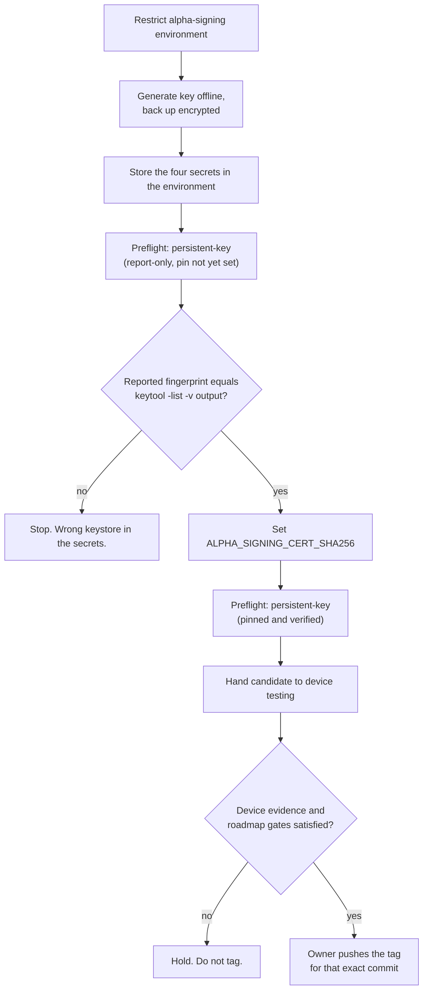

# Releasing Thwiply Alphas

Thwiply alpha tags publish minified, persistently signed APKs for one Android
ABI at a time. The workflow never publishes a universal APK.

## Published artifacts

For tag `v1.0.0-alpha.N`, the release contains:

- `thwiply-v1.0.0-alpha.N-arm64-v8a.apk` for physical devices and ARM64
  emulators;
- `thwiply-v1.0.0-alpha.N-x86_64-emulator.apk` for x86_64 emulators; and
- `SHA256SUMS` covering both APKs.

The arm64-v8a APK must not exceed 33,554,432 bytes (32 MiB). Pull-request CI
builds the same minified arm64 variant and enforces the same limit.

## Signing identity and provisioning

The release workflow requires one long-lived PKCS12 signing key. Provisioning it
is an owner action performed outside this repository, in the order below. The
order matters: the environment is the only thing that restricts who can reach
the secrets, so it must exist before the secrets do.

Required GitHub Actions secrets:

- `ALPHA_KEYSTORE_BASE64`;
- `ALPHA_KEYSTORE_PASSWORD`;
- `ALPHA_KEY_ALIAS`; and
- `ALPHA_KEY_PASSWORD`.

Required GitHub Actions variable:

- `ALPHA_SIGNING_CERT_SHA256` - the expected signing certificate's SHA-256
  fingerprint. This is public certificate metadata, recoverable from any
  published APK, so it is a variable rather than a secret. Pinning it is what
  stops a wrong, rotated, or substituted keystore from producing a release that
  installed alphas cannot upgrade to.

### 1. Restrict the environment before creating any secret

Both `Release optimized alpha APKs` and `Alpha release preflight` run in the
`alpha-signing` environment. Referencing an environment creates it with **no
protection rules**, so until it is configured it restricts nothing.

The in-workflow checks are not a substitute. `workflow_dispatch` runs the
workflow file from the ref it is dispatched on, so the main-ancestry check in
the preflight is a sanity check on the intended revision, not an authorization
boundary - anyone who could bypass it could also edit it. Required reviewers and
deployment branch/tag restrictions on the environment are the real control.

In **Settings > Environments > alpha-signing**, before provisioning anything:

- add the release owner as a **required reviewer**; and
- set **Deployment branches and tags** to `Selected branches and tags`, allowing
  only the `main` branch and the tag pattern `v*`.

### 2. Generate the key offline

Generate the key on a trusted machine, never in CI and never in a repository
working tree. Use strong, independently generated passwords.

```bash
keytool -genkeypair \
  -storetype PKCS12 \
  -keystore thwiply-alpha-signing.p12 \
  -alias thwiply-alpha \
  -keyalg RSA \
  -keysize 4096 \
  -validity 10000
```

Keep an **encrypted offline backup** of `thwiply-alpha-signing.p12` and its
passwords, in a location that survives the loss of the machine that generated
them. Losing this private key permanently ends in-place upgrades: every existing
install would have to be uninstalled and reinstalled, losing local data. Do not
place the keystore, its passwords, or its base64 encoding in the repository,
build logs, release assets, or an unencrypted backup.

### 3. Record the expected fingerprint

Read the fingerprint from the offline keystore. This, not any CI output, is the
source of truth.

```bash
keytool -list -v \
  -keystore thwiply-alpha-signing.p12 \
  -storetype PKCS12 \
  -alias thwiply-alpha |
  grep 'SHA256:'
```

### 4. Store the secrets in the environment

Storing them at environment scope rather than repository scope is what puts them
behind the required reviewer configured in step 1.

```bash
openssl base64 -A -in thwiply-alpha-signing.p12 |
  gh secret set ALPHA_KEYSTORE_BASE64 --env alpha-signing
gh secret set ALPHA_KEYSTORE_PASSWORD --env alpha-signing
gh secret set ALPHA_KEY_ALIAS --env alpha-signing
gh secret set ALPHA_KEY_PASSWORD --env alpha-signing
```

Each `gh secret set` without a value prompts for one on a terminal that does not
echo. Do not pass secret values as command-line arguments, and do not paste them
into chat, tickets, or pull requests.

Leave `ALPHA_SIGNING_CERT_SHA256` unset for now. It is pinned in
[Confirm the signing identity](#confirm-the-signing-identity), after a preflight
run has reported what the configured keystore actually produces.

## Version identity

The tag must match:

```text
v<major>.<minor>.<patch>-alpha.<number>
```

The workflow requires the tagged commit to be contained in `origin/main`.
`versionName` is the tag without the leading `v`; `versionCode` is the full
commit count at the tagged commit. Both ABI artifacts therefore have identical,
deterministic Android version metadata.

Both workflows read this identity back out of each signed APK with
`aapt2 dump badging` and confirm the packaged `versionCode` and `versionName`
match what was requested, and that each APK contains only its own ABI's native
libraries. Passing version properties to Gradle states an intention; this check
is the evidence. It runs before anything is published.

> [!WARNING]
> Releases through `v1.0.0-alpha.3` used ephemeral debug signing. A tester with
> one of those builds installed must **uninstall it once** before installing the
> first persistently signed alpha. That uninstall removes local app data and any
> downloaded model. Never perform it on someone's behalf, and never script it
> into an install step - state the requirement and let the tester decide. Later
> alphas signed by the persistent key update in place as their version code
> increases.

## Local dry run

Before tagging, require a completed successful **Android instrumentation** check
and inspect **Test, lint, and build** for the exact intended `main` commit.
The strict main ruleset enforces the instrumentation check before merge;
the tag workflow itself does not start an emulator job. Wait for `main` CI
after merge rather than relying only on a previous PR revision.

Set the Android SDK and Java locations for the local environment, then build
each ABI separately because both variants use the same output path:

```bash
./gradlew clean :app:assembleAlpha \
  -Pthwiply.abi=arm64-v8a \
  -Pthwiply.versionCode=100 \
  -Pthwiply.versionName=1.0.0-alpha.test
cp app/build/outputs/apk/alpha/app-alpha-unsigned.apk /tmp/thwiply-arm64.apk

./gradlew clean :app:assembleAlpha \
  -Pthwiply.abi=x86_64 \
  -Pthwiply.versionCode=100 \
  -Pthwiply.versionName=1.0.0-alpha.test
cp app/build/outputs/apk/alpha/app-alpha-unsigned.apk /tmp/thwiply-x86_64.apk
```

Run the repository checks before creating a tag:

```bash
bash scripts/test-check-apk-size.sh
bash scripts/test-release-workflows.sh
bash scripts/test-verify-apk-certificate.sh
bash scripts/test-verify-apk-identity.sh
bash scripts/check-apk-size.sh /tmp/thwiply-arm64.apk 33554432
./gradlew verifyBuildscriptBouncyCastle test lint assembleDebug
```

Run the full managed-device command and result checker from
[README's instrumentation setup](../README.md#android-instrumentation) as well.
The debug Room/migration/backup suite does not exercise signed or minified
LiteRT-LM inference. Passing PR CI is not a release deployment or the separate
FND-13 physical-device/minified smoke gate.

Locally sign with a disposable test key and verify with the installed Android
Build Tools `apksigner`. Never use the persistent alpha private key for ad hoc
local builds.

## Validating a candidate without publishing

Pushing a tag publishes. To exercise the real build, signing, and verification
path without publishing anything, run the **Alpha release preflight** workflow.
Its token is read-only, it never calls the releases API, and it cannot create a
tag; it produces installable APKs as a workflow artifact instead.



Dispatch it against a commit already on `main`:

```bash
gh workflow run "Alpha release preflight" \
  --ref main \
  -f candidate_version=v1.0.0-alpha.4 \
  -f signing_key=test-key
```

`candidate_version` only names the version to simulate; no tag is created.
`signing_key` selects the identity:

- `test-key` generates a throwaway key inside the run and discards it. It needs
  no secrets, so it is the way to exercise the pipeline before any key exists.
  Its output is **not** a release candidate.
- `persistent-key` uses the configured signing identity and produces a real
  candidate.

Both modes run in the `alpha-signing` environment, so once a required reviewer
is configured every preflight run waits for approval, including `test-key` runs
that touch no secrets. That is deliberate: one approval gate covers anything
that signs.

### Confirm the signing identity

The first `persistent-key` run happens before `ALPHA_SIGNING_CERT_SHA256` is
set. That run is deliberately **report-only**: it signs, verifies, and reports
the certificate it observed, and warns that nothing verified it. This is the
only way to learn what the configured secrets actually produce - a `test-key`
run reports the throwaway key's fingerprint, which is meaningless here.

Compare the `Certificate SHA-256` line in the run's `CANDIDATE.txt` against the
`keytool -list -v` output from
[Record the expected fingerprint](#3-record-the-expected-fingerprint). They must
match. If they do not, the wrong keystore is in the secrets - stop and correct
that before going further.

Once they match, pin it:

```bash
gh variable set ALPHA_SIGNING_CERT_SHA256 --body "<SHA-256 from keytool>"
```

Both workflows then verify every signed APK against that value. A tag pushed
while the variable is unset fails at `Validate signing secrets`, before anything
is built and long before anything is published, so a release can never be cut
with an unverified key.

### Candidate handoff

Each preflight run uploads one artifact containing both signed APKs,
`SHA256SUMS`, and `CANDIDATE.txt`. `CANDIDATE.txt` records the source commit,
the packaged `versionName` and `versionCode`, the signing identity, the
certificate fingerprint and whether it was pinned, and the checksums.

Hand device testers the artifact. Never hand over the keystore, the passwords,
or any secret value - none of them are needed to install or test an APK.

The filename states what a build is, so it cannot be mistaken by name alone:

| Filename contains | Meaning |
| --- | --- |
| `-TEST-KEY` | Throwaway key. Not a release candidate. Must be uninstalled before installing a persistent-key build. |
| `-candidate-UNVERIFIED` | Real signing key, but the certificate was not checked against the pin. Only for confirming the identity. |
| `-candidate` | Real signing key, certificate verified against the pin. This is a release candidate. |

> [!NOTE]
> This repository is public, so workflow artifacts are downloadable by anyone
> who can see the repository. A preflight does not publish a release, but it is
> not private distribution either.

Verify a downloaded candidate the same way a tester verifies a release:

```bash
# Linux
grep 'arm64-v8a\.apk$' SHA256SUMS | sha256sum -c -
# macOS
grep 'arm64-v8a\.apk$' SHA256SUMS | shasum -a 256 -c -
```

### When a preflight fails

| Failure | Meaning and recovery |
| --- | --- |
| `Missing ALPHA_KEYSTORE_BASE64` (or another secret) | The secret is absent, or the run did not reach the `alpha-signing` environment. Re-check step 4 of provisioning. |
| `Signing certificate does not match the pinned identity` | The keystore in the secrets is not the one that was pinned. Do not edit the pin to match the key. Establish which is correct first; a genuinely rotated key means every install must be uninstalled and reinstalled. |
| `Expected exactly one signer certificate` | The two APKs were signed by different certificates. Treat the run as untrusted. |
| `packaged versionCode ... != expected` | The APK does not carry the requested version. Usually the `thwiply.versionCode` property plumbing in `app/build.gradle.kts`. |
| `expected only '<abi>' native libraries` | An APK carries the wrong ABI's libraries, or none. Check the ABI filter and that the native dependency ships that ABI. |
| `APK exceeds maximum` | The arm64 build passed the 32 MiB budget. |
| `Signing material staged for upload` / `remains in the runner temp directory` | Stop and investigate before re-running. A keystore reached somewhere it should never be. |

A failed preflight publishes nothing, so recovery is to fix the cause and run it
again. The keystore is removed when its step exits, including on failure and on
cancellation, and is never uploaded.

## Publish

Publication is a deliberate, owner-controlled step and the last one. Do not tag
until all of the following hold:

- a `persistent-key` preflight passed with the certificate **pinned and
  verified**;
- device evidence exists for that exact candidate, gathered from the preflight
  artifacts;
- the applicable roadmap gates are satisfied - in particular `FND-13`, which
  covers running the minified build on a real device and is not satisfied by any
  amount of CI; and
- `main` CI is green for the exact commit being tagged, including the
  **Android instrumentation** check.

Tag the exact commit the candidate was built from, not a branch name. `main` may
have advanced since the preflight, and device evidence describes one commit
only. `CANDIDATE.txt` prints the correct command for its own run:

```bash
git fetch origin main --tags
git push origin <source commit from CANDIDATE.txt>:refs/tags/v1.0.0-alpha.4
```

Confirm the tag points where it should before anything else runs:

```bash
git rev-parse v1.0.0-alpha.4^{commit}
```

The tag push starts `Release optimized alpha APKs`, which waits for the
`alpha-signing` environment's required reviewer. It then re-validates tag syntax
and `main` ancestry, runs tests and lint, builds both ABIs, signs them, verifies
the certificate against the pin, confirms the packaged version and per-ABI
native code, enforces the arm64 size budget, generates checksums, and creates
the GitHub prerelease. It rebuilds from source rather than reusing the preflight
artifacts, so every gate runs again against exactly what is published.

### If publication fails

Because identity is verified before the prerelease is created, a failure after
signing leaves no partial release: nothing was published, so fix the cause and
push a new tag.

A tag pushed in error can be deleted with
`git push origin :refs/tags/v1.0.0-alpha.4`, but do not reuse a version number
that has already been published - `versionCode` derives from the commit count,
and testers may already have installed it. Move to the next alpha number
instead.
