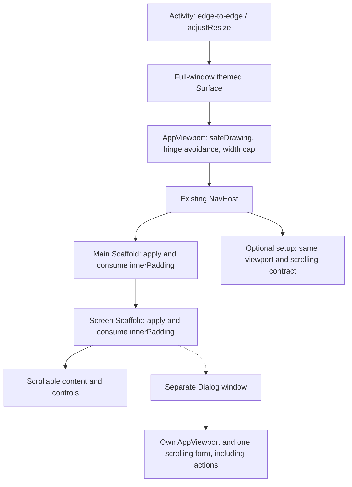
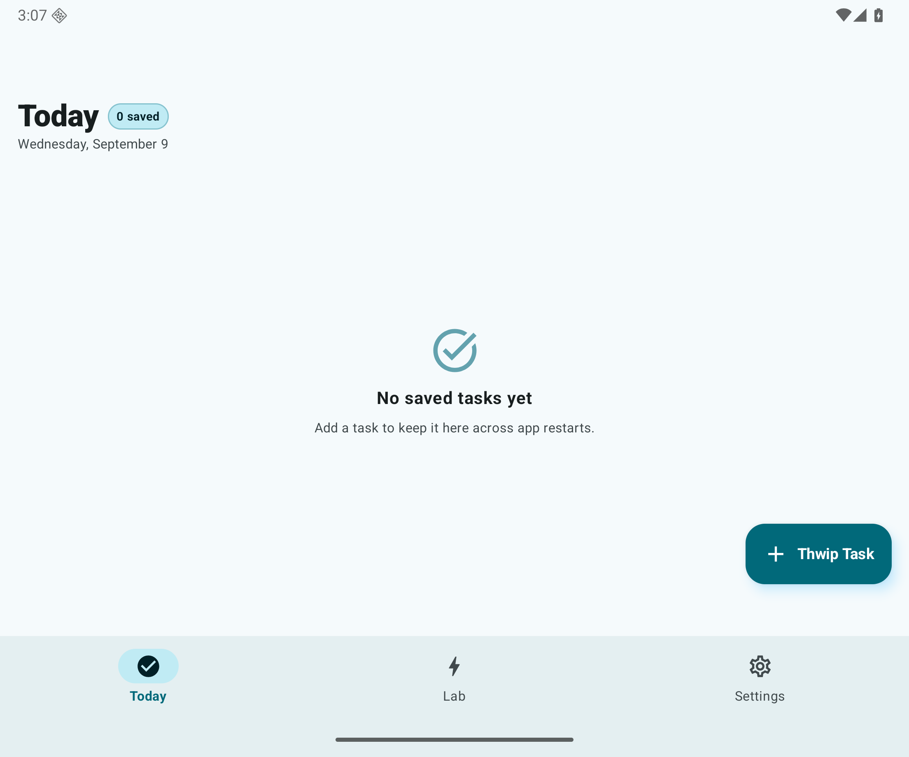
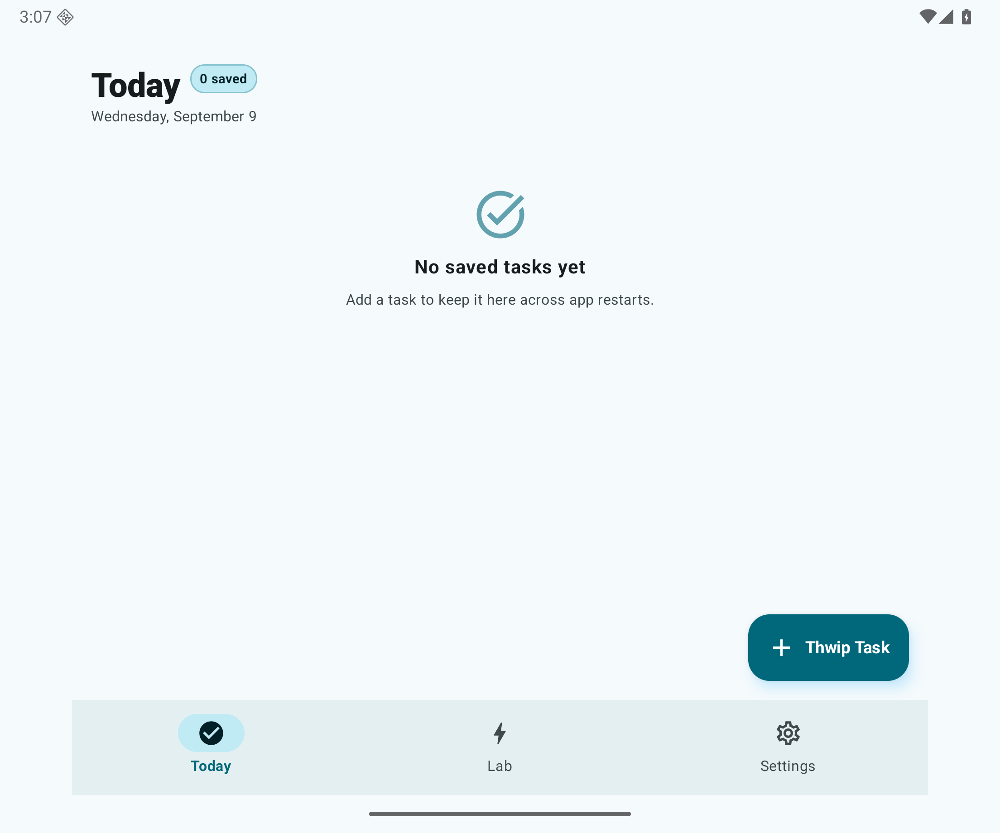
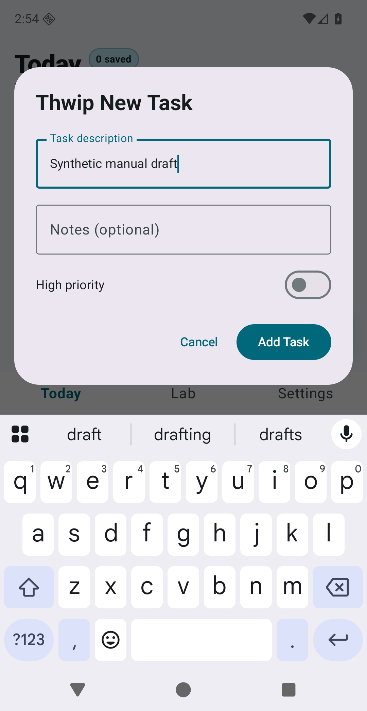
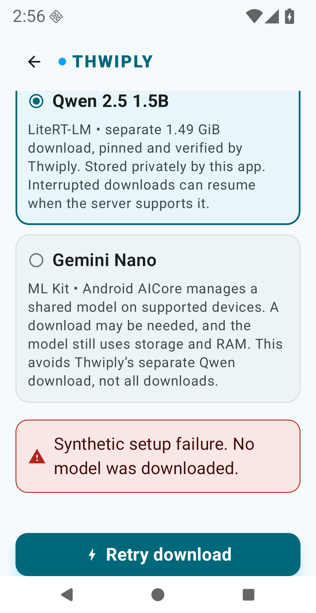
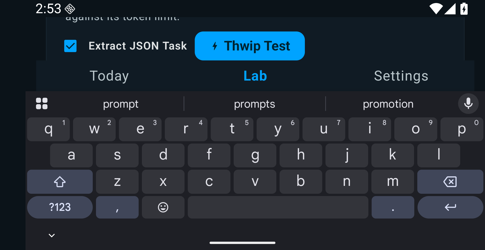
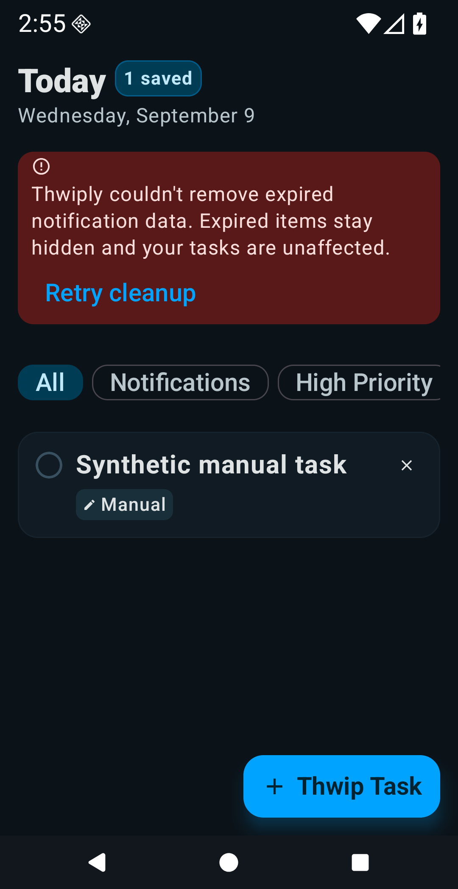
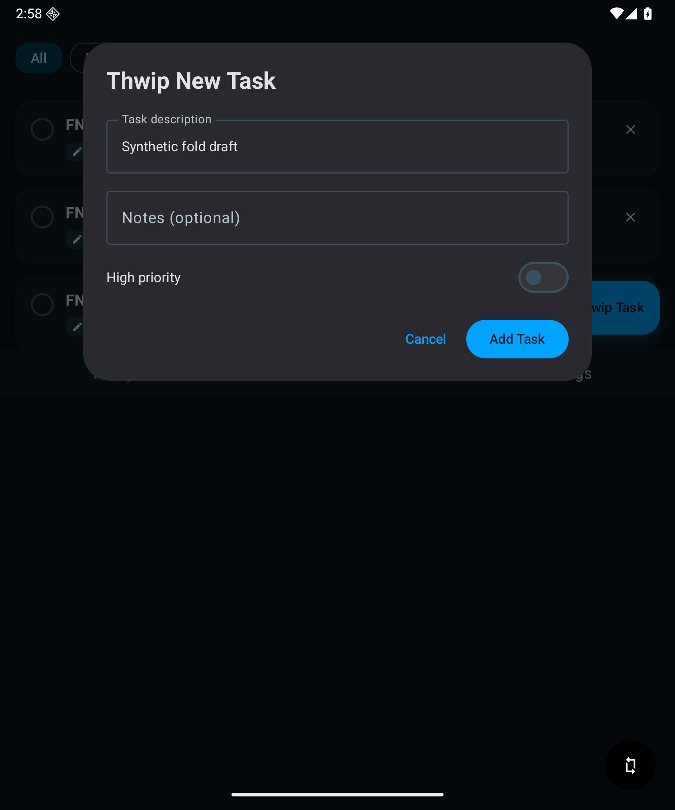

# Window layouts and inset ownership

Thwiply draws edge-to-edge on Android 12+ while keeping controls inside the
current window's usable area. Today, Lab, Settings and optional model setup stay
the same destinations on phones, larger windows and foldables.

## Ownership

`MainActivity` enables edge-to-edge and cutout drawing and declares `adjustResize`.
Its full-window `Surface` supplies the background. `ThwiplyTheme` updates both
system-bar icon appearances from the effective app theme, including a persisted
Light/Dark override of the system theme.

`AppViewport` is the **single safe-inset owner for each window**. It applies
`WindowInsets.safeDrawing`, including system bars, display cutouts and the IME.
`windowInsetsPadding` also consumes the applied insets; do not add a second copy
of that padding in a screen or top bar.

Each nested `Scaffold` still applies its own `innerPadding` for its app chrome,
then calls `consumeWindowInsets(innerPadding)`. Material navigation and scrolling
descendants consequently see only insets not already handled by their ancestors.
Insets are read by layout modifiers rather than remembered as keyboard/status-bar
heights.



`AppAlertDialog` uses a separate Compose `Dialog` window with
`decorFitsSystemWindows = false`. The resolved Compose implementation supplies its
edge-to-edge window configuration; the app supplies theme-aware icon appearance
and the same safe-inset/hinge policy. Title, fields, supporting errors and actions
share one scroll surface, so a short keyboard window does not strand the buttons.
Dialog tests inspect that window's insets, not just the Activity's insets.

See the official [Compose inset consumption guidance][insets] and
[fold-aware layout guidance][folds].

## Adaptive presentation and state

The viewport measures **current parent constraints**, after safe insets, rather
than full-screen dimensions or device names. Reading/form content is centered
and capped at **720 dp**; dialogs are capped at **560 dp**. Narrower windows use
the space actually available.

`WindowInfoTracker` reports separating or fully occluding folding features.
Their window-coordinate bounds determine the largest unobstructed pane; equal
areas prefer the left/top pane. The app uses one pane instead of inventing a
second destination or duplicating content across a hinge. Nonseparating,
nonoccluding flat folds do not split the layout.

Below **480 dp of usable pane height**, the same three destinations use compact
text tabs with at least 48 dp targets, and screen headings join scrolling content.
Long provider descriptions, setup actions, Lab controls and metrics can wrap.
Scrolling to an off-screen action is intentional; it must not remain hidden
behind the keyboard or system UI.

The content remains at one composition site through size/posture changes.
Selected tabs, scroll positions, Lab input and open forms use saveable
presentation state without creating new ViewModel owners. Today's task-list
position is separate from loading/status-list measurement. Its leading header,
warning and filters occupy one stable list item, so changing chrome does not
shift a restored task index.

Task drafts are bounded to 201/501 UTF-16 units, one beyond the existing
200/500-unit title/notes limits. An oversized paste shows explicit truncation
feedback and blocks submission until edited; it is not silently shortened into
a valid saved task. This keeps Activity saved state small while preserving
ordinary drafts and validation errors across recreation.

None of this retains expired Room records, changes the five-second subscription
grace, restarts downloads, or changes provider selection/readiness.
**Visible or lifecycle-STARTED is not Nano authorization**:
`onTopResumedActivityChanged` and `onPause` still govern `InferenceCoordinator`.

## Executed device matrix

Recorded on **2026-09-09** using task-created ARM64 emulators, Android Emulator
**36.3.10.0**, Google APIs **31 revision 11** and **36 revision 7**, and debug
version `ci-alpha`. Window sizes below are approximate dp before safe-inset/IME
deductions, not the capped content width. These are representative combinations,
not a claim to have tested every cross-product or physical device.

| API / configuration | Navigation | Theme / text scale | Executed outcome |
| --- | --- | --- | --- |
| 31, Pixel 2, 411 x 731 portrait | Gesture and three-button | Light; explicit Dark/Light recreation cycles; 1.0 | Full 73-test suite passed; task/Lab input, saved drafts, loading/content, lifecycle and provider regressions exercised. |
| 31, 731 x 411 landscape, dual cutouts | Three-button; additional gesture IME cases | Dark/Light; 1.5 | 12-case layout/IME/warning stress run passed. Actual cutout and keyboard bounds checked; prior 11-case and gesture cases also passed. |
| 31, resized 720 x 960 window | Three-button | Light and bar-theme cycles; 1.5 | Five real-window/recreation/Settings-label cases passed. |
| 36, folded outer display, 411 x 797 portrait | Three-button | Light and bar-theme cycles; 1.0 | Eleven layout/IME/state cases passed; authentic task-entry keyboard capture below. |
| 36, outer display, 797 x 411 landscape, hole cutout | Gesture | Dark capture and bar-theme cycles; 1.5 | Twelve cases passed, including both IME flows, exact inset widths, all Lab bottom tabs above the keyboard and cleanup-warning/manual-task reachability. |
| 36, unfolded 841 x 701; resized 720 x 800 | Gesture | Light and Dark; 1.0 | Full 73-test suite passed. Setup survived resize/rotation and returned to Settings. Reading width stayed bounded. |
| 36, actual OS split-screen, approximately 416 then 549 x 701 | Gesture | Dark; 1.0 | Divider resizing and return to 841 x 701 fullscreen retained Settings and reachable controls; not merely a display-size simulation. |
| 36, half-opened book/tabletop, 841 x 701 / 701 x 841 | Gesture | Dark; 1.0 | A retained real-Activity draft/actions stayed outside vertical/horizontal platform-reported hinges; flat/half-open and rotation transitions preserved the draft. |

The full suites include the original navigation, provider, preferences, Room,
retention and lifecycle cases plus layout regressions. Additional explicit
large-text scenarios passed for setup downloading/error, Nano unavailable,
downloadable/downloading/ready, and preference-read failure. A real Room-backed
cleanup-failure fixture kept a manual task usable while expired records remained
excluded. New scroll tests cover delayed reload and both directions of
header/warning changes through serialized saved state.

The full JVM suite passed **165 tests**. Debug/lint and the existing build-tool
security check passed; lint reported **0 errors / 35 warnings**. The unsigned,
minified arm64 alpha measured **27,218,581 bytes**, below the **33,554,432-byte**
budget. Those packaging results are not signed/minified model-inference evidence.

### Evidence boundaries and environment notes

- All content is synthetic. No model weights were downloaded, no real Nano/Qwen
  inference was performed, and no physical device was used. FND-05/FND-06 and the
  real-model/release gates remain separate.
- The API 36 Pixel Fold image reported hinge sensor postures but had an empty
  `config_display_features`. The platform's supported `display_features` override
  supplied the geometry to **real WindowManager/WindowInfoTracker callbacks**:
  `hinge-[1080,0,1128,1840]`, then `fold-[1104,0,1104,1840]`.
  This is explicitly emulator-supplied geometry, not a physical hinge measurement.
- The API 31 tall-cutout overlay crashed SystemUI. It is **not** counted as passing;
  the healthy dual-cutout configuration supplied the recorded cutout coverage.
- Software-rendered API 36 runs suffered system-service ANRs under host contention.
  One task emulator at a time with the host renderer produced the recorded runs.
  Existing/shared devices were not modified.
- Early failures exposed test-host `adjustPan`, unset layout/IME settlement,
  premature re-entry during native initialization cancellation, width oracles
  that ignored cutouts, and assumptions that off-screen lazy rows were already
  composed. Persistence is checked independently before scrolling to assert
  reachability. The final fixtures use production-equivalent window
  configuration and condition-based waits; exact visibility/no-gap assertions
  remain. A transient hierarchy failure after API 31 startup did not reproduce
  in isolation; the settled portrait full run passed.
- The recorded base is main `2d59285`. Unmerged FND-08 changes in #41 are not included
  in these results. Its verification/recovery/state contracts must be preserved
  when integrating; layout containers must not substitute older readiness logic.

## Reproducing checks

Use a **dedicated emulator containing only synthetic data**, not a personal
installation. Set `JAVA_HOME`/`ANDROID_HOME` as described in the
[README](../README.md#android-instrumentation). Always install app and test APKs
from the same build properties so their packaged version constants agree.

```bash
./gradlew verifyBuildscriptBouncyCastle :app:testDebugUnitTest :app:lintDebug \
  :app:assembleDebug :app:assembleDebugAndroidTest \
  -Pthwiply.versionName=ci-alpha

SERIAL=emulator-5570 # Replace with your own dedicated emulator.
ADB="$ANDROID_HOME/platform-tools/adb"
"$ADB" -s "$SERIAL" emu avd name
"$ADB" -s "$SERIAL" install -r app/build/outputs/apk/debug/app-debug.apk
"$ADB" -s "$SERIAL" install -r app/build/outputs/apk/androidTest/debug/app-debug-androidTest.apk
"$ADB" -s "$SERIAL" shell am instrument -w -r \
  thwiply.elopenmike.com.test/androidx.test.runner.AndroidJUnitRunner
```

The runner must report a nonzero executed count and `OK`; `adb` exit status alone
does not prove test success. The existing managed API 36 CI job independently
checks its XML reports and retains diagnostics.

For a focused run, pass `-e class` with comma-separated fully qualified classes:
`AdaptiveWindowTest`, `AdaptiveContentTest`, `AppNavigationTest`, and
`ui.today.TodayLifecycleObservationTest`, all under `thwiply.elopenmike.com`.
`-e fnd04Orientation landscape` requests and waits for landscape in applicable
tests. Large API 36 windows can ignore app orientation requests; inspect the
actual window and use device rotation controls for those scenarios.

On your dedicated emulator, record original values before changing configuration:

```bash
"$ADB" -s "$SERIAL" shell wm size
"$ADB" -s "$SERIAL" shell wm density
"$ADB" -s "$SERIAL" shell settings get system font_scale
"$ADB" -s "$SERIAL" shell cmd overlay list
"$ADB" -s "$SERIAL" shell cmd uimode night

"$ADB" -s "$SERIAL" shell cmd overlay enable-exclusive --category \
  com.android.internal.systemui.navbar.threebutton
# Alternative: com.android.internal.systemui.navbar.gestural
"$ADB" -s "$SERIAL" shell settings put system font_scale 1.5
"$ADB" -s "$SERIAL" shell cmd overlay enable com.android.internal.display.cutout.emulation.double
"$ADB" -s "$SERIAL" shell wm user-rotation lock 1
```

Restore the original values afterwards. For fold testing, the API 36 emulator
supports `emu sensor set hinge-angle0 90` and `180`; folding closed can activate
the keyguard, which must be dismissed before UI tests. The
[AOSP producer][fold-producer] documents the geometry override. Save its original
value, supply a contained fold/hinge rectangle, and restore it after testing:

```bash
"$ADB" -s "$SERIAL" shell settings get global display_features
"$ADB" -s "$SERIAL" shell settings put global display_features 'hinge-[1080,0,1128,1840]'
# If originally unset:
"$ADB" -s "$SERIAL" shell settings delete global display_features
```

### Authentic screenshots

The existing fixture tests accept `fnd04Scenario`, `fnd04Theme` and a bounded
`fnd04HoldSeconds` (0-60). Logcat tag `FND04Evidence` prints `READY` before the hold.
Capture the settled state; do not drive additional external UI edits while the
fixture's Compose test clock is held.

```bash
"$ADB" -s "$SERIAL" shell am instrument -w -r \
  -e class thwiply.elopenmike.com.AppNavigationTest#deviceEvidenceScenario \
  -e fnd04Scenario lab-ime -e fnd04Theme dark -e fnd04HoldSeconds 30 \
  thwiply.elopenmike.com.test/androidx.test.runner.AndroidJUnitRunner
# From a second terminal during READY:
"$ADB" -s "$SERIAL" shell screencap -p /sdcard/layout.png
"$ADB" -s "$SERIAL" pull /sdcard/layout.png
```

For foldable emulators with multiple physical displays, resolve the active
display using `dumpsys display` / `dumpsys SurfaceFlinger --display-id` and pass
`screencap -d <physical-id>`; do not assume the first display is active.
`AppNavigationTest` also supplies `today-ime`, `today-task`, `settings`, and Lab
missing/initializing/error/ready scenes. `AdaptiveContentTest` supplies setup
error/downloading, Nano state and preference-error scenes. The cleanup-failure
test supplies its Room-backed warning independently of the navigation shell.

| Matched expanded window before FND-04 | After: one inset owner and bounded width |
| --- | --- |
|  |  |

| Task entry, light / three-button keyboard | Setup error and wrapping at 1.5x text |
| --- | --- |
|  |  |



The Lab image intentionally shows scrolling to the submit area in a short window;
the input is reached by scrolling back. The image below is the **Today component
fixture**, not the whole navigation shell.





[insets]: https://developer.android.com/develop/ui/compose/system/insets-ui
[folds]: https://developer.android.com/develop/ui/compose/layouts/adaptive/foldables/make-your-app-fold-aware
[fold-producer]: https://android.googlesource.com/platform/frameworks/base/+/refs/heads/android16-release/libs/WindowManager/Jetpack/src/androidx/window/common/RawFoldingFeatureProducer.java
